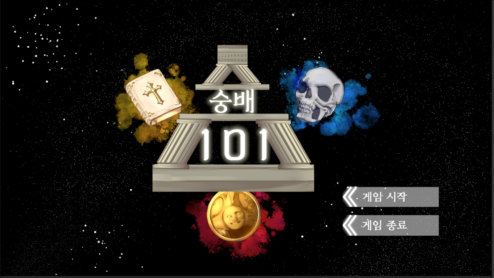
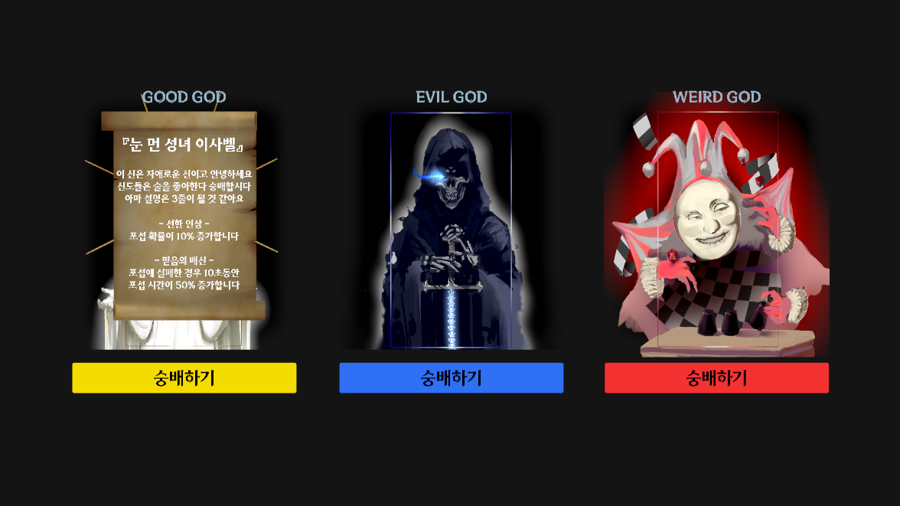
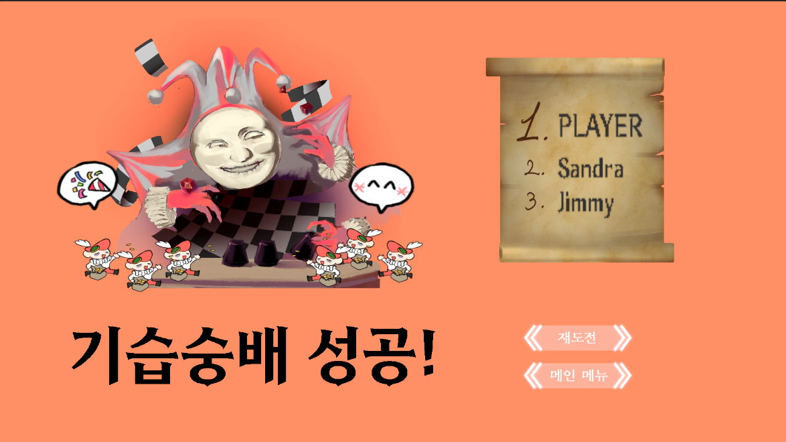

# 숭배 101
## 제 1회 PoolC.GG 게임잼 Oh My God 팀
### PoolC.GG란?
연세대학교 게임 제작 동아리 PoolC에서 OP.GG의 지원을 받아 개최한 게임잼으로  
팀 구성부터 빌드본 제출까지 모두 즉석에서 진행된 2박 3일간의 게임 제작 대회입니다!
### 제작 기간
2024/06/29 16:00 ~ 2024/06/31 19:00
### 구성원
- 기획: 안준수
- 아트: 손은지
- 메인 프로그래머: 정현기
- 서브 프로그래머: 윤혜린
## 플레이 방법
- 모든 조작은 마우스 클릭과 WASD 키로 이뤄집니다
- 게임 시작을 누르면 플레이어가 숭배할 신을 선택할 수 있습니다
    - 각각의 신은 버프 하나와 디버프 하나를 부여합니다
    - 패시브 스킬의 설명은 신의 이미지를 클릭해 확인할 수 있습니다
- 게임이 시작되면 이동하고 싶은 위치를 클릭해 플레이어의 신도 무리를 움직일 수 있습니다
- 회색 원으로 표시된 포교 범위에 중립 NPC들이 들어오면 일정 시간 뒤에 포섭을 시도합니다
    - NPC들의 포섭에 성공하면 우리 신도로 변하고 실패하면 맵에서 퇴장합니다
- 플레이어가 선택하지 않은 두 신의 신도 무리는 AI가 조종하게 됩니다
    - 적대 집단과 마주치면 숭배 배틀을 시작합니다!
    - 화면에 표시되는 방향키에 맞게 WASD키를 정확히 입력하여 상대보다 더 빨리 숭배 게이지를 채우면 승리합니다
    - 숭배 배틀에서 배패한 무리는 신도의 절반을 빼앗기며, 신도가 3명 이하였다면 전원이 맵에서 퇴장합니다
## 엔딩 종류
1. 배드 엔딩
- 제한시간이 끝나기 전에 배틀에서 패배해 모든 신도를 빼앗긴 경우
2. SoSo 엔딩
- 2위 또는 3위로 게임을 끝낸 경우
3. 굿 엔딩
- 1위로 게임을 끝낸 경우

## 게임 플레이 화면

